# Introduction to Leaflet 

.pull-left[

 ###What is Leaflet?

- Create interactive maps
- Open-source JavaScript library
- No JavaScript knowledge required
- Geospatial tool
- R package for easy integration

 

]

.pull-right[

 ###Why Use Leaflet?

- Free (unlike paid geospatial analysis tools like ArcGIS, Tableau)
- Easy to use with knowledge of R
- Clear documentation
- Create interactive maps effortlessly
- Add-ons provide additional features

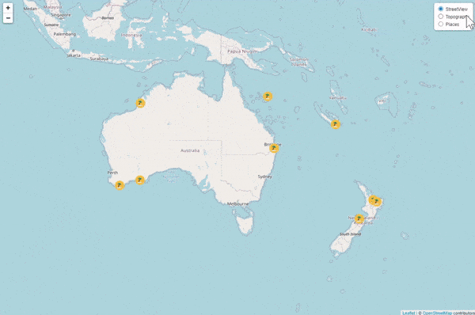>

]

---

# Use Cases

Leaflet is a popular tool for creating interactive maps and is used in various real-life applications across different industries. For example:

.pull-left[
- Real Estate Listings
- Geographic Information Systems (GIS)
- Transportation and Logistics
- Environmental Monitoring

<b>USA Education Map</b>
 
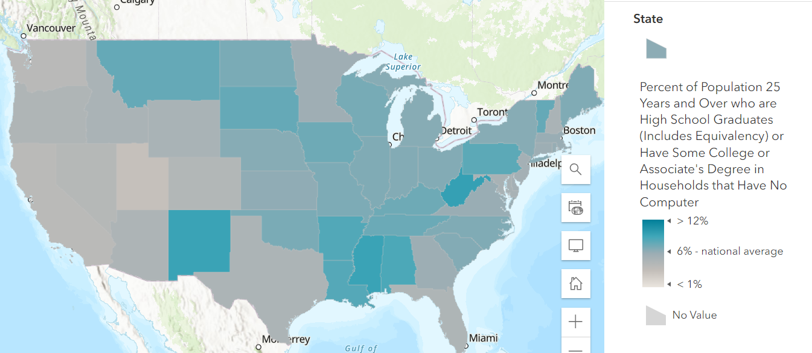

]

.pull-right[
- Wildlife and Conservation
- Location-based services
- Real-time tracking
- Storytelling with maps

<b>USA Wildfire Map</b>
 
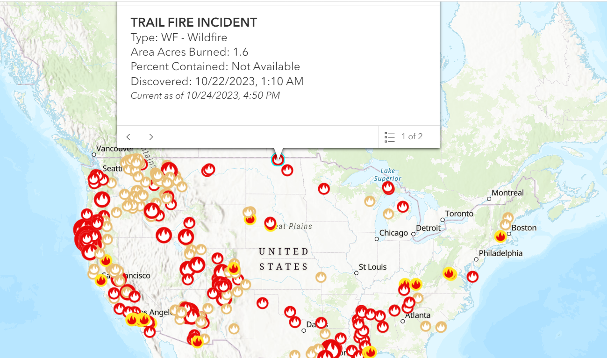

]

---

# Basic Workflow of Leaflet

.pull-left-vsmall[

  

- Step 1: Determine the type of map you want to create
- Step 2: Collect the necessary data
- Step 3: Create your interactive map using Leaflet and R
- Step 4: Publish your map to share with others

]

 
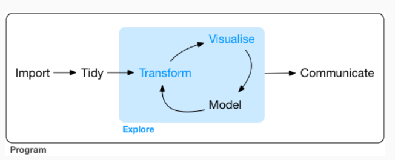

---

# Step 1: Determine the Map Type

 ###Types of Maps
- **Base Maps**: Streets, Satellite, Terrain, Topographic
- **Custom Maps**: Heatmaps, Choropleths, Custom Tile Maps
- **Overlay Maps**: Markers, Circles, Polygons, Lines, Popups and Tooltips
- **Interactive Maps**: Zoom and Pan, Interactive Markers, Layer Control
- **Time-Series Maps**: Temporal Data, Time-Slider

.pull-left[

<b>Chloropleth: Total Votes (%) US 2016 General Elections</b>
 
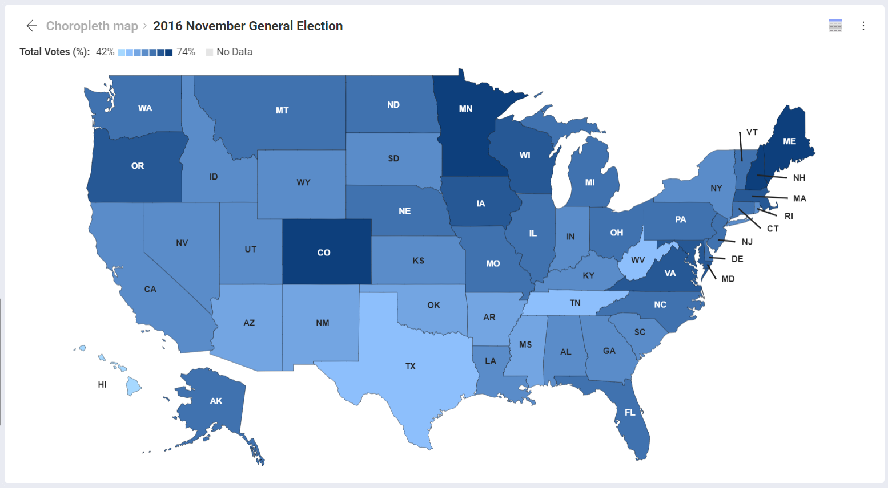

]

.pull-right[

<b>Heatmap: US Population Distribution</b>
 
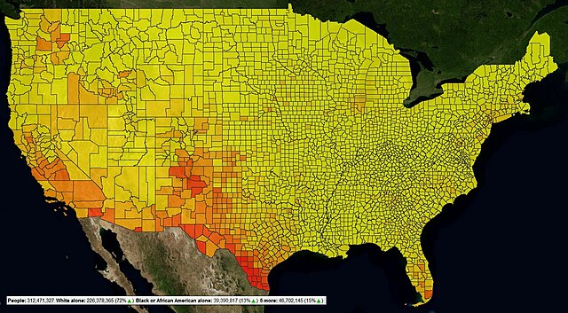

]

---
# Step 1: Types of Maps (Cont)

.pull-left[

 <b>Base Map Types</b>
 
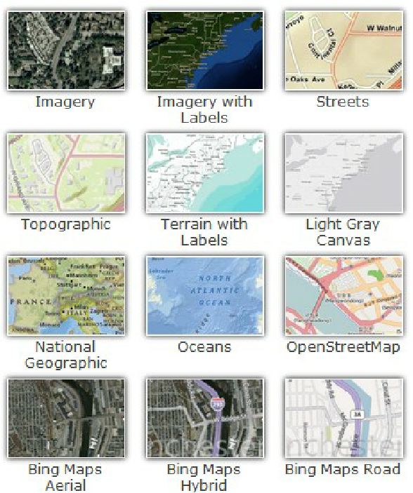

]

.pull-right[

 <b>Time Slider of Corona Spread</b>
 
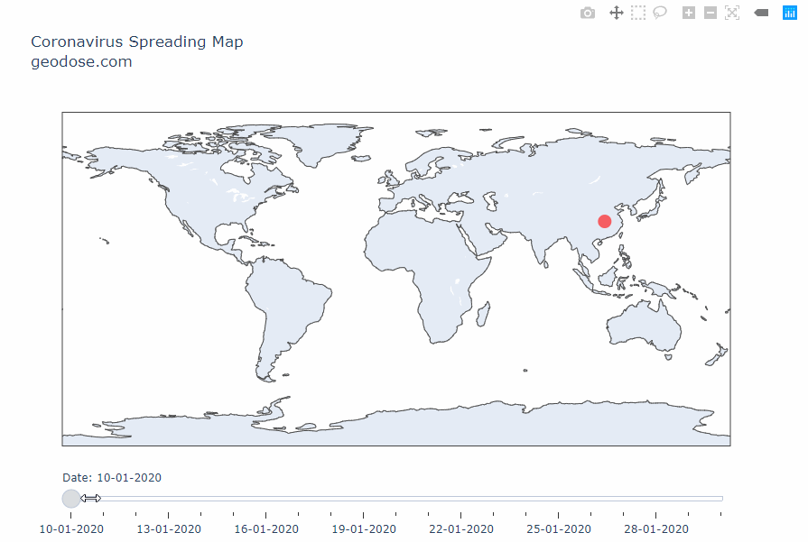

]

---

# Step 2: Collect the Data 

.pull-left[
 
 ###What Data Do You Need?
- Geographic coordinates (latitude, longitude)
- Attributes for populating tooltips and popups
- GeoJSON, CSV, or other compatible data formats

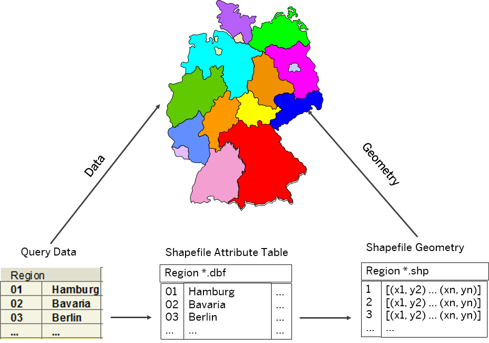

]

.pull-right[

 

 
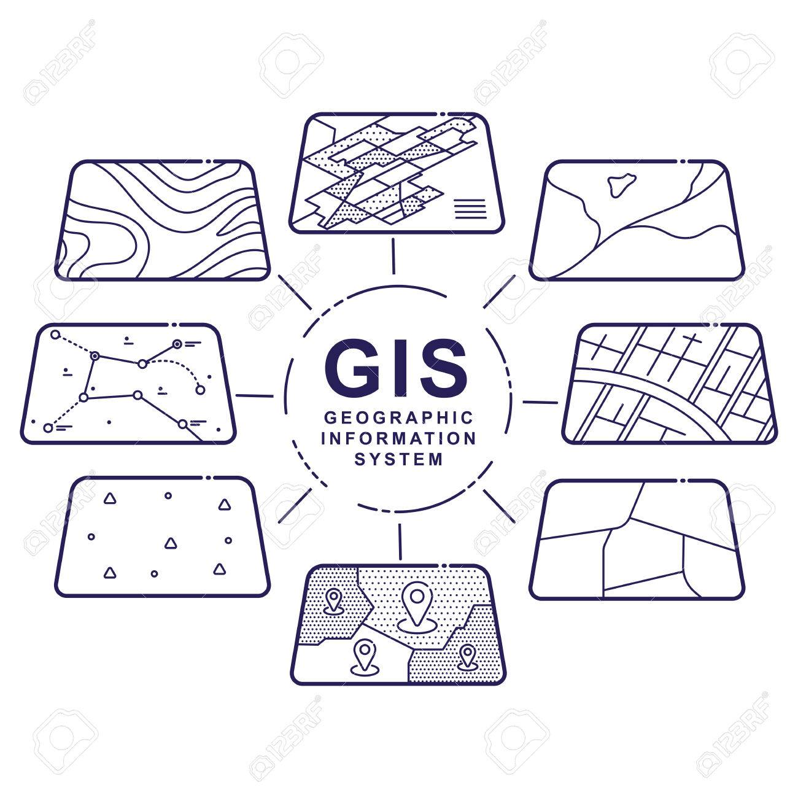

]

---

# Step 3: Create an Interactive Map

  

  
.pull-left-vsmall[
 
###Quick Overview
- Basic Syntax: Creating a map object
- Base Map Selection: Choose a base map style
- Additional Maps: Overlaying data on the base map
 
###Step-by-step Guide

- Step 1: Install and Load Required Packages
- Step 2: Prepare/Load Your Data
- Step 3: Create and Customize the Base Map
- Step 4: Add Data Layers
- Step 5: Customize Popups and Tooltips
]

  

    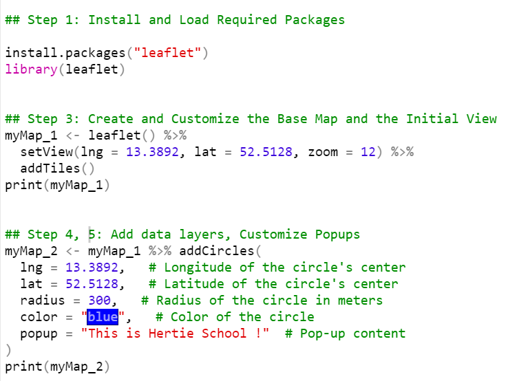
  

---

# Step 3: Create an Interactive Map (Cont)

  

.pull-left-vsmall[

###Layers in Leaflet

- **Tiles**: Provide the background for your maps
- **Markers**: Display points with custom icons
- **Circles**: Show data with radius and color
- **Polygons**: Highlight areas with custom styling
- **Polyline**: Draw lines on the map
- **Popups and Tooltips**: Display information on click
- **Heatmaps**: Visualize concentration/distribution of data

]

  

    <b>Circles and Markers</b>
     
    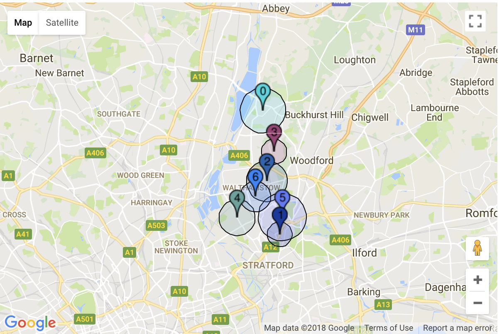
      
     <b>Popup</b>
      
     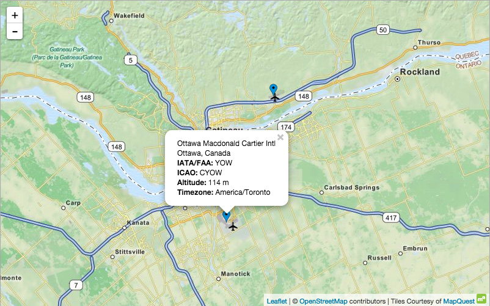
  

---

#Step 4: Publish the Map

###Publishing Methods for Interactive Maps

- **Shiny Web Application**: Develop web-based interactive applications
- **GitHub Pages**: Create a simple HTML page with the map
- **R Markdown**: Publish your R Markdown presentation as an HTML document
- **Interactive PDFs**: Embed maps in PDFs generated from R Markdown. Suitable for sharing within reports or documents
- **Self-hosted Web Server**: Host maps on your own web server
- **Export as a Standalone HTML**: Use saveWidget to save maps as standalone HTML
- **RStudio Connect**: Publish and share maps through RStudio Connect

---

# Further References

.pull-left-vsmall[

###Leaflet

- Official Leaflet [Website](https://leafletjs.com/)
- Documentation of [Leatlet for R](https://rstudio.github.io/leaflet/) 
- Comprehesive [Leaflet Cheat Sheet](https://ugoproto.github.io/ugo_r_doc/pdf/leaflet-cheat-sheet.pdf)

###Data Sources

- List of [Third-Party Tiles](https://leaflet-extras.github.io/leaflet-providers/preview/index.html) addProviderTiles() function
- World Bank [Official Boundaries](https://datacatalog.worldbank.org/search/dataset/0038272)
- European Union [GISCO - the Geographic Information System of the Commission](https://ec.europa.eu/eurostat/web/gisco/geodata/reference-data/administrative-units-statistical-units/countries)
- [List of open GeoJSON datasets](https://open-innovations.org/data/geojson.html)
- DataHub [Geodata data package](https://datahub.io/core/geo-countries
- [GADM Maps and Data](https://gadm.org/)

###Video Tutorials
- [Interactive Maps with R](https://www.youtube.com/playlist?list=PL6wLL_RojB5y8uL3uuIMnJ6JoTIFywQ-r)
- [Leaflet Mapping in R/RStudio](https://www.youtube.com/playlist?list=PLmFi_ou2WwcEyPq7Y9DvzFRLlp9-XvFDb)
]

---
class: inverse, center, middle
name: logistics

# Thank you   Start creating your own interactive maps now!
<html>

</html>

